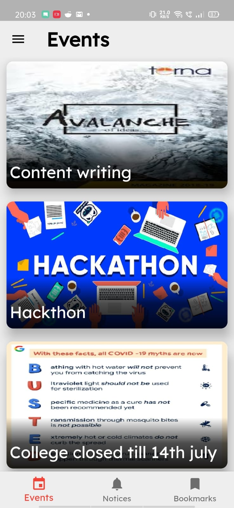
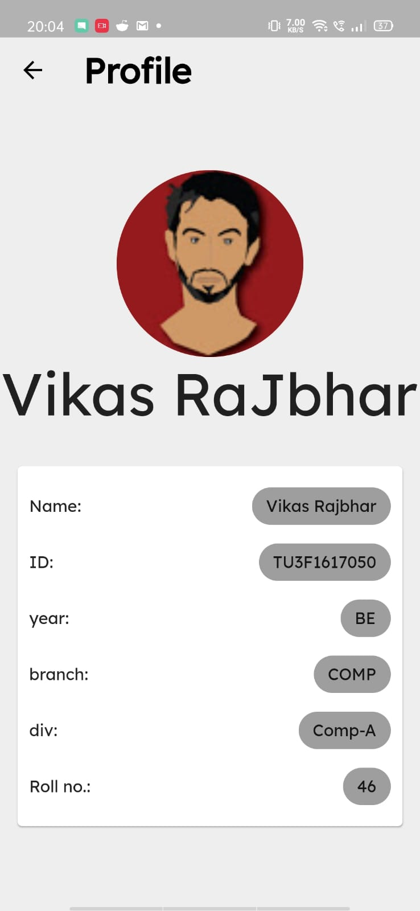
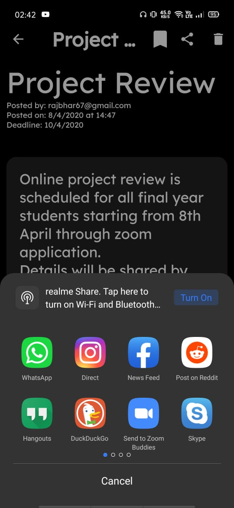
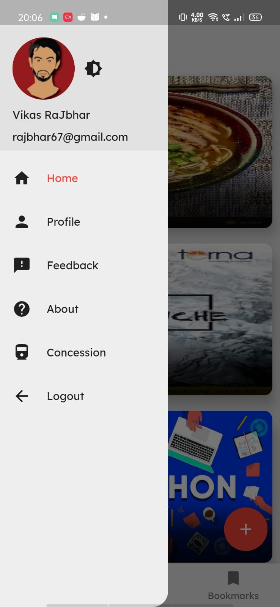
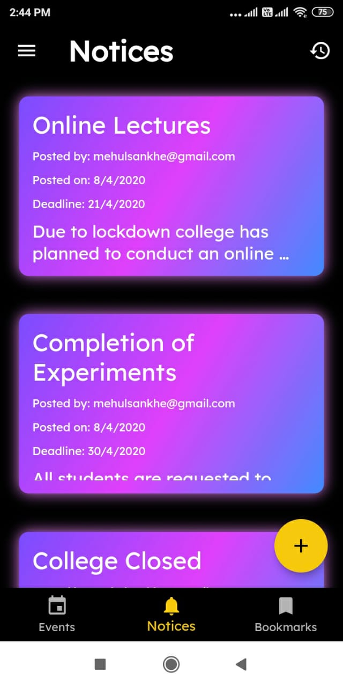

### Description

An android app that acts as a central hub for all important updates of and relating to Terna Engineering College that features a robust access hierarchy thus allowing smoother functioning and moderation. It also features push notifications so one does not have to worry about missing a key update.

### Watch : 
[Click here](https://www.youtube.com/watch?v=1A4GQ3OOl3M&feature=youtu.be&ab_channel=VikasRaJbhar)

### User Features:

#### - Home Page

The Home Page shows all the Events presented in a descending order of their date of publication. 

#### - Profile Page

The profile page shows the user their details. 

#### - Details Page

The details page of an event shows all the relevant information about the event while also allowing for a short message by the organizer.

#### - Sharing

The users have the option to share an event with their peers with whatever means they prefer.

#### - Sidebar

The sidebar allows for easy navigation around the app

#### - Railway Concession

The concession section allows for students to apply Railway Concession online, without waiting in long queue!

### Admin Features:

#### - Event Add Page

The site administrators have a easy way to add events and notify everyone about them.

#### - Notification Page

Finally, the notices tab is a great way for the administrators to send important notifications to the students in a moment's basis.
